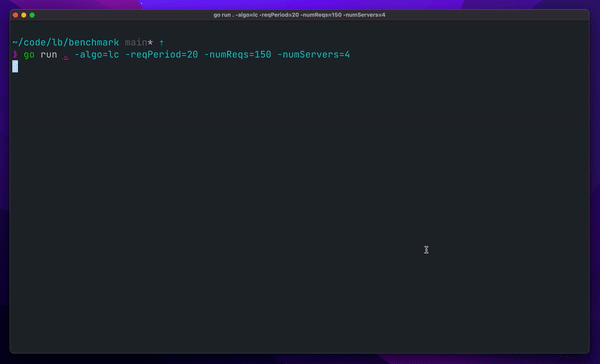

# Level 7 Load Balancer

Simple application level load balancer.

Can use following algorithms:

- Round robin
- Least connections

Active health checks for hosts. Requests are distributed accross active hosts.

## Demo

### Round Robin


### Least Connections



## Usage

```
> l7-load balancer <hosts>
starting load balancer: port=8080 algo=lc
```
